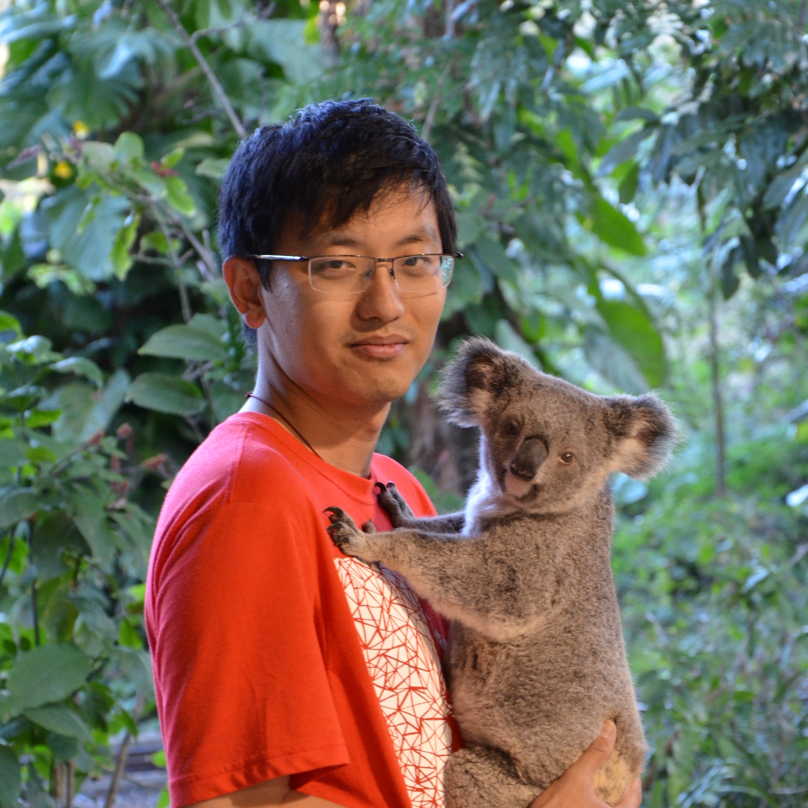

<link rel="stylesheet" href="../style.css">

## Organizing Committee

  

    

    
<a href="https://kaike-zhang.github.io/">Kaike Zhang</a>

    
University of Chinese Academy of Sciences

  

  

    

    
<a href="https://profile.yunfan.info">Yunfan Wu</a>

    
University of Chinese Academy of Sciences

  

  

    

    
<a href="https://youganglyu.github.io/">Yougang Lyu</a>

    
University of Amsterdam

  

  

    

    
<a href="https://scholar.google.com/citations?hl=en&user=w2pQByMAAAAJ&view_op=list_works&gmla=AL3_zigxd_kXXPJGKuE2SyjKu9lFnBizozo0T_zEMjDbmMOPgrzym7_9YfBTfVIwJ8Nib7pys8H-ZOeDmjQNMRwe45ggeCYz3I3ptA">Du Su</a>

    
Institute of Computing Technology, Chinese Academy of Sciences

  

  

    

    
<a href="https://yingqiangge.github.io/">Yingqiang Ge</a>

    
Amazon

  

  

    

    
<a href="https://scholar.google.com/citations?user=kivnB4QAAAAJ&hl=zh-CN">Shuchang Liu</a>

    
Kuai Shou

  

  

    

    
<a href="https://caoqi92.github.io/">Qi Cao</a>

    
Institute of Computing Technology, Chinese Academy of Sciences

  

  

    

    
<a href="https://renzhaochun.github.io/">Zhaochun Ren</a>

    
Leiden University

  

  

    

    
<a href="http://ofey.me/">Fei Sun</a>

    
Institute of Computing Technology, Chinese Academy of Sciences

  

<!-- 
## Organizing Committee

<a href="https://kaike-zhang.github.io/">Kaike Zhang</a>

University of Chinese Academy of Sciences

<a href="profile.yunfan.info">Yunfan Wu</a>

University of Chinese Academy of Sciences

<a href="https://youganglyu.github.io/">Yougang Lyu</a>

University of Amsterdam

<a href="https://scholar.google.com/citations?hl=en&user=w2pQByMAAAAJ&view_op=list_works&gmla=AL3_zigxd_kXXPJGKuE2SyjKu9lFnBizozo0T_zEMjDbmMOPgrzym7_9YfBTfVIwJ8Nib7pys8H-ZOeDmjQNMRwe45ggeCYz3I3ptA">Du Su</a>

Institute of Computing Technology, Chinese Academy of Sciences

<a href="https://yingqiangge.github.io/">Yingqiang Ge</a>

Amazon

<a href="https://scholar.google.com/citations?user=kivnB4QAAAAJ&hl=zh-CN">Shuchang Liu</a>

Kuai Shou

<a href="https://caoqi92.github.io/">Qi Cao</a>

Institute of Computing Technology, Chinese Academy of Sciences

<a href="https://renzhaochun.github.io/">Zhaochun Ren</a>

Leiden University

<a href="http://ofey.me/">Fei Sun</a>

Institute of Computing Technology, Chinese Academy of Sciences

 
-->

<!-- 
## Organized By

  <h2>Organized by</h2>
  

    
    
    
    
    
    
  

-->

