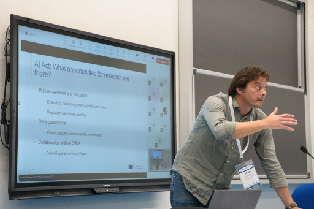

About 35 in-person and 20 on-line attendees have joined the workshop has held successfully.

Thanks for all presenters and attendees.

The summary article about the workshop is available at <a href="https://doi.org/10.1145/3640457.3687111">The ACM Ditital Library</a>

The 7th FAccTRec Workshop on Responsible Recommendation at [RecSys 2024](https://recsys.acm.org/recsys24/) is a valuable catalyst for research and community-building around fairness, accountability, transparency, and related topics in recommender systems.
In this workshop, we welcome research and position papers about ethical, social, and legal issues brought by the development and the use of recommendations that will support a discussion on providing and evaluating socially responsible recommendations.

## What's New

* 2024-10-14: Workshop is held.
* 2024-09-27: We fix the [program]({{ "/program/" | relative_url }})
* 2024-09-12: [Keynote by João Vinagre]({{ "/keynote/" | relative_url }})
* 2024-08-02: the submission deadline is extended until 2024-08-09
* 2024-05-09: the CFP is available
* 2024-04-23: opening this site
* 2023-09-16: <a rel="me" href="https://recsys.social/@FAccTRec">Follow us on Mastodon</a>

## Important Dates

* 2024-08-02 2024-08-09: Paper submission deadline
* 2024-08-27 2024-09-03: Author notification
* 2024-09-10 2024-09-17: Final version upload
* 2024-10-14: Workshop (full day)

TIMEZONE: Anywhere On Earth (UTC-12)

<!-- ## FAccT Network

The FAccTRec 2023 workshop is proudly a part of the [FAccT network](https://facctconference.org/network/), to publish and engage with fairness, accountability, and transparency scholars across connected disciplines. -->
