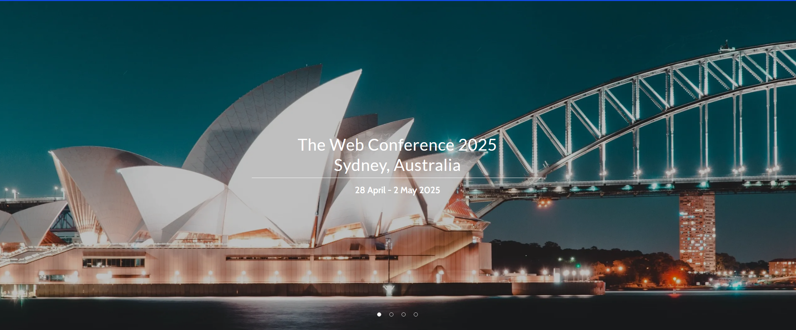

The 1st Workshop on Human-Centered Recommender Systems will take place at <a href="https://www2025.thewebconf.org/"> WebConf 2025</a> in Sydney, Australia, from April 28–May 2, 2025.

We invite you to join discussions on ethical, user-centered, and socially responsible recommender systems!

The 1st Workshop on Human-Centered Recommender Systems (HCRS) at [WebConf 2025](https://www2025.thewebconf.org/) provides a collaborative platform for researchers, industry professionals, and academics to explore the development of recommender systems that prioritize human needs, values, and capabilities. Topics include robustness, privacy, transparency, fairness, diversity, accountability, ethical considerations, user-friendly design, and innovative evaluation methods.

## Important Dates

* **2024-12-18**: Paper submission deadline  
* **2025-01-13**: Author notification  
* **2025-02-02**: Camera-ready submission  
* **2025-04-28**: Workshop at WebConf 2025 (Half-day session)

TIMEZONE: Anywhere On Earth (UTC-12)

## Workshop Objectives

This workshop aims to:

1. Foster discussions on the evolving field of Human-Centered Recommender Systems.
2. Encourage interdisciplinary approaches for ethical and user-centered system design.
3. Share innovative methodologies, evaluation frameworks, and applications.
4. Promote diversity and inclusion within the recommender systems community.

## Program Highlights

* **Keynote Talks**: Delivered by leading researchers in HCRS.  
* **Paper Sessions**: Presentations of accepted papers showcasing cutting-edge research.  
* **Panel Discussion**: Future directions and challenges in human-centered recommender systems.  

## Call for Papers

We welcome submissions on the following topics (but not limited to):

- **Robustness**: Fraud detection, adversarial defenses, certifiable robustness, etc.  
- **Privacy**: Differential privacy, federated learning, unlearning, etc.  
- **Transparency**: Explainable and interpretable RS, causal explanations, etc.  
- **Fairness and Bias**: Debiasing, fairness in LLM-based RS, etc.  
- **Diversity**: Addressing filter bubbles, user perception of diversity, etc.  
- **Ethics**: Mitigating misinformation, ethical frameworks, etc.  
- **Accountability**: Traceability, responsible RS, etc.  
- **Human-Computer Interaction Design**: Accessible and inclusive interfaces, conversational RS, etc.  
- **Evaluation and Auditing**: User studies, algorithm governance, innovative metrics, etc.  

For submission guidelines, visit the [Call for Papers page]({{ "/cfp/" | relative_url }}).

## Organizers

The workshop is organized by an international and diverse team of experts in the field:

- **Kaike Zhang** (University of Chinese Academy of Sciences, China)  
- **Yunfan Wu** (University of Chinese Academy of Sciences, China)  
- **Yougang Lyu** (University of Amsterdam, Netherlands)  
- **Du Su** (Institute of Computing Technology, Chinese Academy of Sciences, China)  
- **Yingqiang Ge** (Amazon, USA)  
- **Shuchang Liu** (Kuaishou, China)  
- **Qi Cao** (Institute of Computing Technology, Chinese Academy of Sciences, China)  
- **Zhaochun Ren** (Leiden University, Netherlands)  
- **Fei Sun** (Institute of Computing Technology, Chinese Academy of Sciences, China)  

---

For questions or concerns, feel free to contact us at [kaikezhang99@gmail.com](mailto:kaikezhang99@gmail.com).

We look forward to your participation in the workshop!
